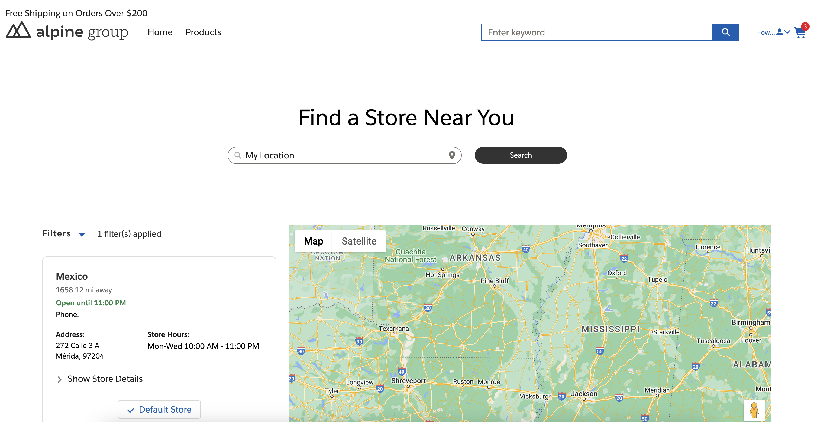

# Store Locator

## Table of Contents
- [Overview](#overview)
- [Installation Steps](#installation-steps)
- [Data Steps](#data-steps)
- [Access Steps](#access-steps)
- [Configuration Steps](#configuration-steps)
- [Considerations](#considerations)

## Overview
The Store Locator component is designed to allow you to show a visual list of all the stores that are available to users in a commmerce or standard community. This component does the following:
- Google Maps with location indicators
- Collects current location to show distances
- Shows multiple locations
- Show Store details 
- Search store locations
- Unit Select (mi / km)
- Default Max Search Radius
- Preferred Store selection

Store locations are pulled from the 'Location' object and basedon the Location Address object to find where the stores are located. 

# Setup
## Installation Steps
1. Deploy the custom fields
2. Deploy the apex classes
3. Deploy the LWC 'Store Locator'

## Data Steps
1. Navigate to the Location object and create a new record similiar to the following (note: you won't be able to add the visitor address until after you've initially saved the locaiton record, we'll do that in the next step). 

2. Edit the record you just created and click into the Visitor Address field until the '+ New Address' dropdown opens. 
3. Create a new Visitor Address, the lat & long fields at the bottom of the page will populate after saving the address. (Make sure the Type is set to 'Site')

4. Navigate to the account you will be using to view the component, update the 'Default Store' field with the new location you created

## Access Steps
1. Provide Apex Class access for 'Commerce_StoreLocator' to all users who will be interacting with this component on the storefront through a profile or permission set.

## Configuration Steps
1. Open your experience builder for the site you wish this component to be on, create a new page called 'Store Locator' (or anything else you'd like to call the page)
2. Drag the new 'Store Locator' component onto your page, note the default values of the component and configure any of them as you'd like
3. Publish the site (Login as a community user and visit the store location page to view your component)

# Usage
## Initial Load
During the initial load of the component there are several aspects loads in order to visualize the information correctly. The following is a overview of that functionality: 
- Load the users location 
- Load the users 'Preferred' Location, this is based on which one is associated with their account
- Load the rest of the locations based on the default location distances
- Load the map and results 

## Search
The search functionality can be used to find the right store locations. In order to test this you should create multiple locations all of them with a different address / location / name to be able to see this functionality working. 
Searching works with the following fields as follows: 
- Name: Included in the search term 
- State: Exact match to the state
- City: Exact match to the city
- Zip: Exact match to the zip code

## Filtering
The filtering functionality is a great feature to narrow down the results if you have locations across the world. You can slide the value down to the desired distance and click 'Apply Filter' for the results to update. 

# Considerations
This version does not support following features:
- Currently only 'Site' Type Location Addresses will show on the component, this can be updated in the component if you desire to extend this functionality. 
- Filtering by Type is also not supported, but it is commented out in the code if you desire to enhance the functionality 